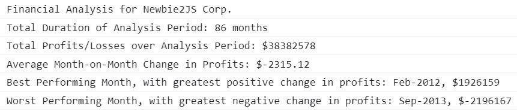
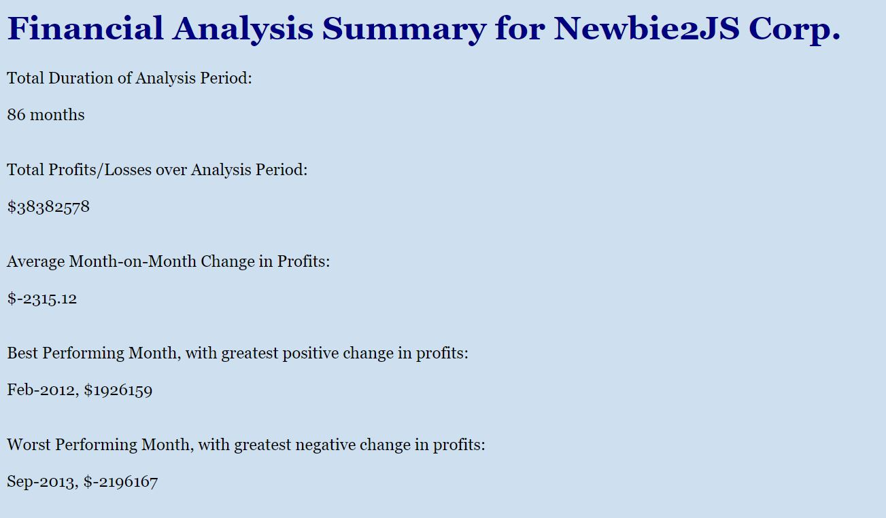

# Console-Finances

## Description  

The objective of this project was to create code to analyse the financial records of a company over an approximate seven year period, from January 2010 to February 2017. The financial dataset was provided as an array consisting of nested arrays with two fields: Date and Profit/Loss values.  
  

The project was carried out using JavaScript code which analysed the records to determine each of the following:

- The total number of months included in the dataset;

- The net total amount of Profits/Losses over the entire period;

- The average of the changes in Profit/Losses over the entire period.

- The greatest increase in profits (date and amount) over the entire period.

- The greatest decrease in losses (date and amount) over the entire period.

## Installation

The site, linked below, was deployed using GitHub Pages. 

Simply upload the index.html, index.js and license.txt files, along with the assets folder which contains the images, to the desired webserver.

## Usage

The final code prints the analysis to the console, as well as displaying the summarised analysis on the webpage.

[Link to the deployed Financial Analysis Summary website on GitHub Pages](xxx)

[Link to the GitHub code repository](https://github.com/CcMong/Console-Finances)

  

## Credits

N/A

## License

MIT License.

Please refer to the LICENSE in the repo.

## Badges

